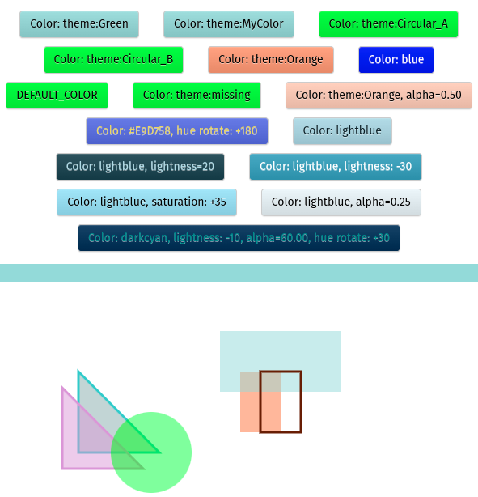

<p align="center">
    
</p>

# Color Management
Simple to use color mangement dependency for use in [Anvil](https://anvil.works/) apps.

## Why
I keep finding myself writing a dumb function, or importing the `theme_color_to_css()` function from the `m3` theme,  to extract the theme color as needed for custom components.  I thought this would be a good opportunity to use some of the surprising color operations in CSS and make something I could reuse.

## What I wanted out of the dependency
* Extract theme colors as necessary
* Resolve theme colors that reference other theme colors
* Provide a default color when there is a theme color error
* Adjust hue
* Adjust saturation
* Adjust lightness
* Adjust transparency
* Stupid simple to use


## Demo




## Consistent Usage
As long as you have something that is CSS compatible, things should just work.
``` python
cm.Color("red") -> "red"
cm.Color("#F00") -> "#F00"
cm.Color("theme:Green") -> "#96D9D9" # in this example
cm.Color("rgb(255 121 1") -> "rgb(255 121 1"
cm.Color(component.background) -> <color_from_component>
cm.Color(cm.Color("red")) -> "red"
```

## Theme color reference
Allow theme colors to reference another theme color.  This is done recursively, so reference can be arbitrarily deep as long as there is no circular reference, in which case, a warning is given and the default color is returned.  I find this helpful to allow theme colors to be added that are more descriptive but still reference the current color scheme.  ie. `theme:canvas_background = theme:Primary`.
``` python
cm.Color("theme:Green") -> "#96D9D9"
cm.Color("theme:MyColor") -> "#96D9D9"
cm.Color("theme:Circular_A") -> <DEFAULT_COLOR>
>> "Warning: Circular Reference in theme colors {'theme:Circular_A', 'theme:Circular_B'}"
cm.Color("theme:missing") -> <DEFAULT_COLOR>
>> "Warning: Theme color 'theme:missing' not found. Using default color 'lime'"
```


## Usage Examples
``` python
from color_management import cm

my_color = cm.Color("theme:MyColor")
# Create a contrasting color
component.background = my_color
component.foreground = my_color.hue_rotate(180).shift_lightness(-50)

# Use in Canvas styles
shape_color = cm.Color("Red")
c.stroke_style = shape_color.set_lightness(20)
c.fill_style = shape_color.set_lightness(80).set_alpha(0.5)

# Resolve custom component property colors selected in designer
self.my_component.background = cm.Color(self.background_color)
```

## Color Management App

[Clone Color Management](https://anvil.works/build#clone:XDCHQEWZS46YWLAB=TZZOR4HKHYCLBQTXA3WSXFPJ)

App Token for third-party dependency use: `XDCHQEWZS46YWLAB`